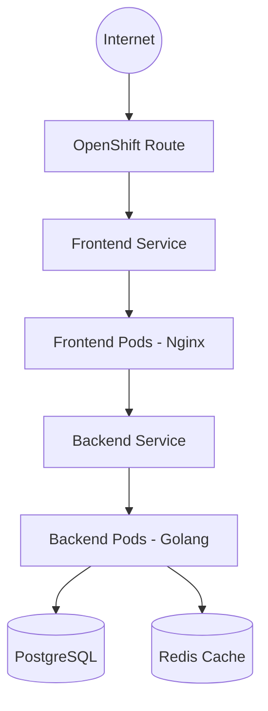

Här är ett förslag på en professionell `README.md`. Jag har strukturerat om innehållet för att lyfta fram din tekniska kompetens, lagt till snyggare formatering och inkluderat en sektion för ditt nyskapade **GitHub Actions CI/CD-workflow**.

Denna version är designad för att imponera på rekryterare och tekniska kollegor genom att visa att du har koll på hela kedjan: från arkitektur till automatisering.

---

# Cloud-Native Guestbook: OpenShift Distributed System

[](https://github.com/DITT_ANVÄNDARNAMN/DITT_REPO/actions)


Detta projekt demonstrerar en modern, distribuerad gästboksapplikation byggd för **OpenShift**. Systemet är designat enligt *cloud-native* principer och implementerar en robust arkitektur med fokus på skalbarhet, säkerhet och prestanda.

## 🚀 Teknisk Stack & Arkitektur

Applikationen är uppdelad i tre logiska lager som samverkar i ett OpenShift-kluster:

*   **Frontend:** Nginx-baserad webbserver optimerad för OpenShift DNS-uppslag.
*   **Backend:** Golang API som hanterar affärslogik och datakommunikation.
*   **Data Tier:** PostgreSQL för persistent lagring och Redis för distribuerad caching.

### Systemöversikt


---

## 🛠 Nyckelfunktioner

*   **CI/CD Automation:** Integrerat GitHub Actions-workflow för automatiserad validering av konfiguration och kod vid varje push/pull request.
*   **Container Optimization:** Använder *multi-stage builds* (Red Hat UBI-images) för att minimera attackytan och hålla image-storleken nere.
*   **State Management:** Implementerad persistent lagring (PV/PVC) för databasstabilitet.
*   **Säkerhet:** Separation av känslig data via **Secrets** och applikationsinställningar via **ConfigMaps**.
*   **Service Discovery:** Sömlös intern kommunikation via OpenShift-klustrets inbyggda DNS.

---

## 📦 Komponenter & Konfiguration

### Backend (Golang)
API:et kräver följande miljövariabler för att etablera anslutningar:

| Variabel | Beskrivning | Standardvärde |
| :--- | :--- | :--- |
| `DB_HOST` | Hostname för PostgreSQL | `localhost` |
| `DB_USER` | Databasanvändare | `guestbook` |
| `REDIS_HOST` | Hostname för Redis cache | `localhost` |
| `PORT` | Lyssningsport | `8080` |

### Frontend (Nginx)
Konfigurerad för att använda klustrets DNS-resolver för att dynamiskt hitta backend-tjänsten:
```nginx
resolver dns-default.openshift-dns.svc.cluster.local valid=30s;
upstream backend {
    server backend:8080;
}
```

---

## 🤖 Automatisering (GitHub Actions)

Projektet använder GitHub Actions för att säkerställa hög kodkvalitet. Workflowet inkluderar:
1.  **Linting:** Kontroll av YAML-filer och syntax.
2.  **Build Validation:** Verifiering att container-images kan byggas korrekt.
3.  **Security Scan:** Grundläggande scanning av konfigurationsfiler.

---

## 🚦 Komma igång

### Förutsättningar
*   Tillgång till ett OpenShift-kluster (eller OKD/Minishift).
*   `oc` CLI installerat.

### Installation i urval
1.  **Kloning:** `git clone https://github.com/DITT_ANVÄNDARNAMN/OPENSHIFT-LABB.git`
2.  **Deploy av databas:** Skapa PersistentVolumeClaims och kör PostgreSQL/Redis pods.
3.  **Konfiguration:** Applicera Secrets och ConfigMaps:
    ```bash
    oc create secret generic db-pass --from-literal=password=YOUR_SECURE_PASS
    oc apply -f k8s/configmap.yaml
    ```
4.  **Exponering:** Skapa en Route för att nå frontend externt:
    ```bash
    oc expose svc/frontend
    ```

---

## 🧪 Verifiering & Testning

När systemet är uppe, använd följande för att verifiera hälsostatus:

```bash
# Kontrollera API-hälsa
curl -i http://<route-url>/health

# Verifiera Caching (titta efter X-Cache header)
curl -i http://<route-url>/api/stats
```

---

## 🧠 Reflektion & Designval
Som en del av arkitekturen har följande val gjorts:
*   **High Availability:** Backend är konfigurerad för horisontell skalning (2+ repliker).
*   **Caching Strategi:** Redis minskar belastningen på PostgreSQL för lästunga operationer (statistik).
*   **Säkerhet:** Inga råa lösenord finns i källkoden; allt injiceras via miljövariabler i OpenShift.

---
*Detta projekt är skapat som en del av [DITT PROGRAM/KURS]. Vid frågor, vänligen kontakta [DITT NAMN].*

---

### Tips för din GitHub-profil:
1.  **Byt ut länkarna:** Se till att länken till ditt workflow (badge) och ditt användarnamn är korrekta.
2.  **Bilder:** Om du har screenshots från gästboken, lägg dem i en mapp som heter `docs/images` och inkludera dem i README-filen för att göra den mer visuell.
3.  **Filstruktur:** Lägg gärna till en liten sektion som visar din filstruktur (t.ex. `/openshift`, `/src`, `/nginx`), det uppskattas ofta.
